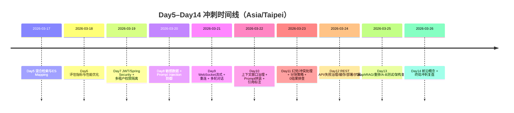

⭐⭐⭐  
# 基于 prompt5.2 的14天学习计划改造版（已完成Day1–Day4，进度从Day5开始）

## 执行摘要

我将以 **prompt5.2(RAG).txt** 作为“学习协议与事实基线”，保留其核心结构与关键要点（人格/技术/行动协议、强约束、项目产出目标、代码事实、每日产物与排障固定流程），并把 **第二份 Markdown 文件（deep-research-report.md）** 作为“每日题目与任务导向”，把 **Day5–Day14（剩余10天）** 的计划落到“逐日逐题、可验真、可复述”的执行表上。fileciteturn1file0 fileciteturn1file1

本报告的目标不是“我看完题就算学了”，而是让我在 **每一天** 都能达到：  
我对当天题目能输出 **30秒答法 + 2分钟答法 + 追问防御点**，并且对涉及实现细节的题，能给出 **证据链**（代码位置/配置/关键变量/可运行命令/日志字段），严格避免空话、编造、或引入未在项目/材料中出现的组件。fileciteturn1file0

因为我已经完成 Day1–Day4（按要求进度从 Day5 开始），本报告将 **只对 Day5–Day14 做逐日详细任务表**；同时保留 prompt5.2 中对 Day1–Day4 的“学习成果基线”和“代码事实（Code Truths）”，把它们当作我 Day5 之后回答题目时的证据底座。fileciteturn1file0

关于题库信息：在你的需求文字里，你把“题库文件格式/题目数量/题目难度、以及第二份md中题目是否提供”标注为“未提供”。我会在文末按要求列出需要你补充的清单；同时，我也会直接依据你提供的第二份 Markdown 文件里已经写出的 Day5–Day14 题目清单来生成计划（若将来你更新题库/题号映射，我再做二次对齐）。fileciteturn1file1

---

## prompt5.2 基底保留项与改造原则

### 我对学习助手的“人格协议”与输出风格约束

我要求我的学习助手（也就是我接下来要跟随的训练方式）满足以下风格与纪律：  
我希望它具备“户山香澄式元气＋严格技术导师”的双模式：鼓励我持续推进，但一进入代码/架构/排障就必须逐条验真、逻辑不通立刻指出。fileciteturn1file0

我同时保留 prompt5.2 的硬性规则作为“对我自己的训练纪律”：  
我要求每天产出、拒绝空话、拒绝编造、拒绝引入项目材料里没出现的组件或指标（例如：不凭空写QPS/吞吐/效果比例；不凭空写 Milvus/SSE/RRF 等）。fileciteturn1file0

### 我对项目目标与最终产出的承诺

我保留 prompt5.2 的总体目标：14天内吃透 Pai-RAG，并结合我已有的 CI/CD 全自动化知识库项目，形成可面试、可写简历的“项目矩阵”。最终产出包含：  
- Pai-RAG 简历亮点（6点）与 CI/CD 简历亮点（3-4点 STAR 法则）  
- 1分钟版与3分钟深挖版的面试口述稿，以及“三项目组合打法”  
- 关键链路理解清单（按 Day 归档）  
fileciteturn1file0

### 我必须遵守的“技术共识”强约束

我保留并执行 prompt5.2 的强约束（这是我每天写“干扰项”时的裁判标准）：  
- 向量检索与混合检索以 Elasticsearch 为主（`dense_vector` + 混合检索）；不写 Milvus，除非我能提供真实代码/配置/调用证据。citeturn5search3 fileciteturn1file0  
- 流式通信以 WebSocket 为主；不写 SSE，除非我能提供真实接口与代码证据。citeturn1search1 fileciteturn1file0  
- 不写 RRF，除非源码确实实现且我能解释公式与参数。fileciteturn1file0  
- 不写任何性能/效果数字，除非我能提供本地可复现证据。fileciteturn1file0  

另外，我保留 prompt5.2 对 CI/CD 项目“高光事实”的限定：CI/CD 经验只能基于那四个真实痛点与解决方式来转述，严禁我为了显得厉害而编造其他场景。fileciteturn1file0

---

## Day5–Day14题目驱动学习任务表（按第二份Markdown为准）

> 本段的题目清单以第二份 Markdown 文件为“每日任务导向”。其中包含“来源文件名/题号/题目原文”，但不包含更具体的外部出处链接，因此我统一标注为：**题库未提供具体来源**。fileciteturn1file1  
> 我已完成 Day1–Day4，因此以下只展开 Day5–Day14。fileciteturn1file0

### 我每日固定交付物（来自 prompt5.2 行动协议）

我每天固定交付两样东西（不做就等于没学会）：  
- 当日 Trace Table（至少2行）：入口接口｜关键类.方法｜输入｜副作用（写DB/Redis/MinIO/Kafka/ES）｜输出  
- 30–90秒口述稿：我做了什么→为什么这样设计→失败怎么办（必须人话版，能直接面试说出口）  
fileciteturn1file0

### Day5（2026-03-17）混合检索与ES Mapping

#### 当日目标
我今天要把“混合检索 + 权限预过滤 + ES Mapping关键字段”讲到面试可落地：我不仅能说概念，还能解释 `topK/k/num_candidates` 的意义与取舍（`num_candidates`是近似kNN召回控制参数，影响速度与召回准确性）。citeturn0search0turn5search3 fileciteturn1file1

#### 题目清单、必须掌握要点、优先级与时长
| 优先级 | 题目（题库原文；题库未提供具体来源） | 我必须掌握的要点/知识点 | 建议时长 |
|---|---|---|---|
| P0 | `RAG面试题.txt#2` 在设计RAG系统时，如何选择合适的向量数据库？Elasticsearch、Pinecone等有什么区别？ | 我用统一维度对比：ES既能做全文检索也能做向量检索（`dense_vector`用于kNN检索）citeturn5search3；Pinecone定位为托管向量数据库+工作流（文档强调向量库与namespace隔离思路）citeturn13search4；最后回到“我为什么选ES”=统一技术栈与工程复杂度控制 | 35–45min |
| P0 | `RAG面试题.txt#3` RAG系统中的混合检索是什么？如何实现？ | 我能讲清：BM25是ES默认文本相似度之一citeturn5search1；kNN用于向量相似检索citeturn0search0turn5search3；混合=双路召回+融合排序/重排（先召回候选，再融合得分输出topK） | 30–40min |
| P0 | `知识库检索面试题.txt#1` 用户输入一句话点击搜索，系统经历怎样流程？ | 我能画链路：鉴权→embedding→ES权限filter→BM25/kNN→融合排序→返回chunks→（若问答）拼Prompt→LLM生成 | 25–35min |
| P1 | `知识库检索面试题.txt#8` ES索引Mapping定义哪些关键字段？ | 我能列“必须字段”：text字段（BM25）、向量字段`dense_vector`（dims/index/similarity等）citeturn5search3；以及元数据字段（userId/orgTag/isPublic/fileMd5/chunkId等） | 25–35min |
| P1 | `知识库检索面试题.txt#4` `topK`参数做什么？怎么排序？ | 我能说明：topK=返回条数；排序=融合得分；同时能解释kNN检索中候选集合与`num_candidates`对召回/延迟的影响citeturn0search0 | 15–20min |
| P2 | `知识库检索面试题.txt#2/#3/#5`（三题） | 我能快速讲清：为什么需要混合检索；只语义/只关键词的局限；以及“用ES实现混合检索”的一句话答案 | 20–30min |

#### 干扰项（为何是干扰）
- “Milvus/pgvector/Weaviate 等向量库全面横评”：题库今天只要求 ES vs Pinecone；而 prompt5.2 明确要求不引入未在项目出现的组件（除非我有代码证据）。fileciteturn1file0  
- “RRF重排”：prompt5.2明确禁止硬写RRF，除非源码有实现。fileciteturn1file0  
- “把SSE当成实现方案”：强约束是WebSocket为主；SSE没有代码证据就只作为概念对比，不能写成我实现。fileciteturn1file0  

#### 学习任务（行动项）
1) 我输出Day5的Trace Table（至少2行）：一次“search入口”与一次“ES查询组装/执行”。fileciteturn1file0  
2) 我写“1分钟口述稿”：混合检索=BM25+向量kNN+融合排序+权限filter；并准备2个追问：`num_candidates`是什么/为什么权限过滤要前置。citeturn0search0turn5search1  
3) 我做一次“验真动作”：确认我项目里 ES 索引是否使用 `dense_vector` 以及其参数（dims/index/similarity）。citeturn5search3  

#### 当日自测
- 自测1：我能否用90秒讲清“ES混合检索为什么不是单纯把两种结果拼起来”。  
- 自测2：我能否解释“kNN里`num_candidates`调大为什么可能更准但更慢”citeturn0search0。  

#### 当日复盘
- 当晚：复述8题的30秒答法各一遍；标记3题最不稳。  
- 次日开场：先复述这3题再进入Day6。

---

### Day6（2026-03-18）检索质量评估与性能优化

#### 当日目标
我今天要形成“评估→定位→优化→回归”的工程闭环，能说清传统检索指标（Precision/Recall/MRR等）与RAG指标（Faithfulness/Context Precision等）。citeturn14search2turn14search46 fileciteturn1file1

#### 题目清单表
| 优先级 | 题目（题库原文；题库未提供具体来源） | 必须掌握要点 | 建议时长 |
|---|---|---|---|
| P0 | `RAG面试题.txt#8` 检索质量指标有哪些？ | 我能说清Precision/Recall@K、MRR定义与意义citeturn14search46；RAG评估可用Faithfulness/Context Precision等citeturn14search2 | 30–40min |
| P0 | `知识库检索面试题.txt#6/#7` 混合检索原理与结果评估？ | 我能把“检索质量”与“生成质量”拆开看；并能说明权重如何用数据/反馈调优（不编造数字）citeturn14search2 | 40–55min |
| P0 | `知识库检索面试题.txt#9` 慢响应如何优化？ | 我能给“定位清单”：先测量，再查ES查询与候选，再调`num_candidates`与候选策略（不凭空写组件）citeturn0search0 | 35–50min |
| P1 | `RAG面试题.txt#10` 置信度评分机制？ | 我能给多信号：top1-top2 gap、命中数量、来源一致性、阈值拒答/澄清策略 | 20–30min |
| P1 | `RAG面试题.txt#14` 性能瓶颈在哪？怎么优化？ | 我能分层：Embedding调用、kNN候选、融合排序、网络I/O；并能举出调参点（`num_candidates`）citeturn0search0 | 25–35min |
| P2 | `知识库检索面试题.txt#12/#13` 高维向量配置/大规模瓶颈？ | 我能讲`dense_vector`的维度限制与索引参数citeturn5search0turn5search3 | 20–30min |

#### 干扰项（为何是干扰）
- “把评估写成论文推导”：我今天目标是面试可讲、工程可做的闭环，而不是公式推演。  
- “把瓶颈归因成‘机器不行’”：我必须能定位到环节并给出可调项（例如kNN候选与`num_candidates`）。citeturn0search0  

#### 学习任务（行动项）
1) 我写一页“指标对照表”：检索指标 vs 生成指标；并写出每个指标想回答的问题。citeturn14search2  
2) 我写一份“慢查询优化剧本”：观察→定位→调整→回归（不引入新工具）。fileciteturn1file0  

#### 自测
- 我能否解释：为什么“Faithfulness高但Answer Relevance低”更像检索问题还是生成问题citeturn14search0turn14search2。

#### 复盘
- 当晚回顾Day5最弱的3题；次日开场先复述这3题再进Day7。

---

### Day7（2026-03-19）多租户权限与JWT/Spring Security全链路

#### 当日目标
我今天要把“认证→授权→数据隔离→检索权限预过滤”讲成端到端链路，并能说明在 Spring Security 里如何建规则与过滤链。citeturn1search0turn1search3 fileciteturn1file1

#### 题目表
| 优先级 | 题目（题库原文；题库未提供具体来源） | 必须掌握要点 | 时长 |
|---|---|---|---|
| P0 | `RAG面试题.txt#6` 多租户权限控制与数据隔离？ | 我能区分：功能权限（角色）与数据域隔离（orgTag）；并强调检索阶段filter前置隔离 | 30–40min |
| P0 | `知识库检索面试题.txt#10` 检索如何确保只在权限范围内？ | 我能说明：ES filter（userId/orgTag/isPublic）先过滤再算分，避免越权数据进入候选集 | 35–45min |
| P0 | `用户管理面试题.txt#5/#6` JWT校验与Spring Security集成？ | 我能讲清请求级授权配置与过滤器顺序citeturn1search0；JWT安全要点：签名验证、过期校验、存储与传输安全citeturn1search2turn1search3 | 40–55min |
| P1 | `用户管理面试题.txt#4` JWT payload怎么设计？风险？ | 我能讲：放用户与权限信息的收益 vs 风险（泄露/陈旧权限/撤销难）citeturn1search2turn1search3 | 25–35min |
| P2 | `用户管理面试题.txt#1/#2/#3` 模块概览、组织标签意义、Session vs JWT | 我能给出清晰叙事与选择理由（不编造） | 25–35min |

#### 干扰项
- “把JWT当成decode就信”：OWASP强调必须验证签名和`exp/iat/nbf`等声明；不验证签名是高危。citeturn1search2turn1search3  
- “把权限交给LLM自觉不说”：我必须坚持服务端强制过滤与最小暴露。fileciteturn1file0  

#### 行动项
1) 我画一张链路图：JWT→SecurityContext→authorize→ES filter。citeturn1search0  
2) 我写3个追问与防御：token过期怎么办？orgTag变更怎么办？权限过滤落点在哪？

#### 自测
- 60秒回答：“我如何保证检索不会越权？”（必须答到filter前置+JWT链路）。

#### 复盘
- 当晚回顾Day6最弱3题；次日开场复述再进Day8。

---

### Day8（2026-03-20）安全：敏感数据与提示词注入

#### 当日目标
我今天要把“传统安全 + LLM新增风险”讲清：Prompt Injection 是 OWASP LLM Top10 的核心风险类别之一（LLM01）。citeturn6search0turn6search49 fileciteturn1file1

#### 题目表
| 优先级 | 题目（题库原文；题库未提供具体来源） | 必须掌握要点 | 时长 |
|---|---|---|---|
| P0 | `架构设计面试题.txt#20` 提示词注入如何防？ | 我能按OWASP Top10讲风险→防护分层：输入约束/系统提示保护/输出处理/权限最小化/审计citeturn6search0turn6search49 | 40–55min |
| P0 | `RAG面试题.txt#20` RAG如何保护敏感数据？ | 我能讲：分级、脱敏、最小暴露、权限过滤、审计；并强调“检索层强隔离” | 30–40min |
| P0 | `用户管理面试题.txt#10` JWT安全/刷新机制？ | 我能讲签名验证与过期管理、安全存储与传输citeturn1search2turn1search3 | 30–45min |
| P1 | `用户管理面试题.txt#8/#9/#11` 组织变更、多级组织树、访问控制落点 | 我能给可执行策略（不编造我未实现的功能） | 40–55min |
| P2 | `架构设计面试题.txt#21` 本地部署LLM vs 云API取舍 | 我能从成本/隐私/运维/延迟分析，并用AI风险管理框架做“风险意识”补充citeturn6search4 | 15–25min |

#### 干扰项
- “把Prompt Injection当文案技巧”：OWASP把它定义为系统性风险，不是写长提示词就能解决。citeturn6search0turn6search49  
- “引入未在项目出现的安全组件/网关”：我必须先有证据再谈实现。fileciteturn1file0  

#### 行动项与自测
- 我写一套“拒答与澄清模板”，用于：检索无结果/置信度低/疑似越权请求。  
- 自测：2分钟说明“Prompt Injection如何导致越权或敏感信息泄露”，并给三条工程对策。citeturn6search0  

#### 复盘
- 当晚回顾Day7的JWT与过滤链；次日开场复述再进Day9。

---

### Day9（2026-03-21）WebSocket流式问答与多轮对话

#### 当日目标
我今天要讲清“打字机流式效果”与WebSocket的必要性：WebSocket通过握手升级后在TCP上进行双向通信，这是RFC6455所规范的协议机制。citeturn1search1 fileciteturn1file1

#### 题目表
| 优先级 | 题目（题库原文；题库未提供具体来源） | 必须掌握要点 | 时长 |
|---|---|---|---|
| P0 | `聊天助手面试题.txt#1/#2` 流式响应怎么做？WS vs HTTP区别？ | 我能讲：增量chunk推送、前端逐字渲染；WS与HTTP请求-响应模型的本质差异citeturn1search1 | 35–50min |
| P0 | `聊天助手面试题.txt#3` 断线/重连机制？ | 我能讲：心跳、重试、会话恢复、幂等；并能说明资源清理与异常兜底 | 30–45min |
| P1 | `聊天助手面试题.txt#4/#5/#6` WS鉴权、多轮对话、为何Redis存历史 | 我能讲：token在握手阶段传递与校验citeturn1search3；Redis用于高频读写与过期策略（不编造） | 35–50min |
| P2 | `架构设计面试题.txt#15/#18` 端到端RAG流程与流式架构挑战 | SSE只作为概念对比，不写成实现fileciteturn1file0 | 20–30min |

#### 干扰项
- “SSE作为实现”：prompt5.2强约束要求WebSocket为主；没有SSE代码证据就不写成实现。fileciteturn1file0  

#### 行动项与自测
- 行动项：我输出“WebSocket相关Trace Table”至少2行：握手/鉴权、消息处理/推送。fileciteturn1file0  
- 自测：60秒解释“为什么这里必须用WebSocket而不是HTTP轮询”。citeturn1search1  

#### 复盘
- 当晚回顾Day8安全题；次日开场复述再进Day10。

---

### Day10（2026-03-22）上下文窗口治理与Prompt拼装

#### 当日目标
我今天要把“上下文窗口有限”讲清：对话变长时如何裁剪/摘要/滑动窗口，并能说明“历史（Redis）+检索chunks（ES）+当前问题”如何拼成高质量Prompt；另外要能说明如何防止诱导越权检索属于LLM应用安全范畴。citeturn6search0 fileciteturn1file1

#### 题目表
| 优先级 | 题目（题库原文；题库未提供具体来源） | 必须掌握要点 | 时长 |
|---|---|---|---|
| P0 | `聊天助手面试题.txt#11` Prompt怎么拼？ | 我能讲system规则+context+history+userMessage的拼装顺序与目的（避免指令覆盖、减少噪音） | 35–45min |
| P0 | `聊天助手面试题.txt#8` 对话太长怎么处理？ | 滑动窗口/摘要/保留关键轮次；目标是控制token而不丢关键信息 | 25–40min |
| P0 | `聊天助手面试题.txt#10` 如何防诱导越权？ | 权限在检索层硬过滤；Prompt Injection属于OWASP重点风险citeturn6search0 | 30–45min |
| P1 | `RAG面试题.txt#15` 上下文窗口有限RAG怎么解决？ | 检索增强+topK控制+摘要/重排策略 | 20–30min |
| P1 | `聊天助手面试题.txt#7/#9/#12/#13` Redis结构/知识库集成/无关检索处理/引用标注 | 我能讲清“引用可追溯”的实现思路（chunk携带来源ID） | 45–60min |

#### 干扰项
- “把function calling当主线”：function calling是Day14主题，今天只做概念预热不深挖。citeturn9search4  

#### 行动项与自测
- 行动项：我写“Prompt拼装口述稿”1分钟版+3分钟版。  
- 自测：我能否解释“为什么把规则放在system而不是user message”。  

#### 复盘
- 当晚回顾Day9的WS鉴权与重连；次日开场复述再进Day11。

---

### Day11（2026-03-23）幻觉、分块策略、0结果排查

#### 当日目标
我今天要能讲清：RAG幻觉是什么、怎么预防；检索结果为0怎么排查；固定长度分块与语义分块的取舍；跨chunk信息完整性怎么处理。citeturn14search2 fileciteturn1file1

#### 题目表
| 优先级 | 题目（题库原文；题库未提供具体来源） | 必须掌握要点 | 时长 |
|---|---|---|---|
| P0 | `RAG面试题.txt#9` 幻觉问题与预防？ | 幻觉=回答无法被上下文支撑；预防=检索质量、回答约束、置信度拒答；可用Faithfulness评估citeturn14search2 | 35–45min |
| P0 | `RAG面试题.txt#24` 0检索结果如何排查？ | 权限filter是否过严、索引是否有数据、向量化是否成功、字段/Analyzer/Mapping是否匹配citeturn5search3 | 30–45min |
| P0 | `RAG面试题.txt#7` 检索知识与预训练知识冲突怎么办？ | 以外部知识为准、引用标注、表达不确定性、必要时澄清 | 25–35min |
| P1 | `RAG面试题.txt#11/#12` 分块策略与跨chunk完整性 | overlap/父子chunk/引用回溯；固定长度 vs 语义分块取舍 | 40–55min |
| P2 | `RAG面试题.txt#16/#17/#18` 多轮上下文管理、指代消解、领域特殊注意 | 重点是“可执行策略”而非泛泛而谈 | 30–45min |

#### 干扰项
- “把幻觉只归因模型不行”：我必须能提出工程策略与验证指标（Faithfulness/Context Precision）。citeturn14search2  

#### 行动项与自测
- 行动项：我写一份“0结果排查清单”（5步以内，能当场背）。  
- 自测：我拿一个例子，把“冲突时我怎么回答”说成30秒版本。

#### 复盘
- 当晚回顾Day10 Prompt拼装；次日开场复述再进Day12。

---

### Day12（2026-03-24）工程化：REST API设计、外部API失败治理、缓存、部署与扩展

#### 当日目标
我今天要能用工程语言描述：RAG系统的REST API如何设计；外部Embedding/LLM调用失败如何超时/重试/降级；以及系统增长瓶颈预测。对HTTP状态码语义，我按RFC9110理解。citeturn11search0 fileciteturn1file1

#### 题目表
| 优先级 | 题目（题库原文；题库未提供具体来源） | 必须掌握要点 | 时长 |
|---|---|---|---|
| P0 | `RAG面试题.txt#25` 外部API失败怎么处理？ | 超时、重试、降级、错误分类、幂等；避免雪崩（不编造链路指标）citeturn0search2 | 35–50min |
| P0 | `RAG面试题.txt#19` RESTful API怎么设计？ | 资源建模、方法语义、状态码选择（RFC9110）citeturn11search0；可用OpenAPI描述契约citeturn10search3 | 30–45min |
| P0 | `架构设计面试题.txt#24` 规模增长哪里先瓶颈？ | DB连接、ES检索压力、Kafka处理能力等，对比解释 | 25–35min |
| P1 | `架构设计面试题.txt#14/#22/#23` 缓存、部署、扩展性 | 缓存原则：高频读、计算昂贵、可接受短暂不一致；部署与监控“只讲我有证据的方式”fileciteturn1file0 | 45–60min |
| P2 | `文件上传解析面试题.txt#18/#19` 跨存储最终一致与一致性删除（待完善） | 我按“原则答法+证据缺口”答：幂等、补偿、重试、最终一致；不编造我未实现机制 | 30–45min |

#### 干扰项
- “为了回答监控，临时引入Prometheus/Kibana等”：prompt5.2明确禁止引入未出现组件；我只能讲我确实有的日志/健康检查/容器状态证据。fileciteturn1file0  

#### 行动项与自测
- 行动项：我写一份“外部API失败治理口述稿”（含超时/重试/降级/幂等）。citeturn0search2  
- 自测：我能不用看笔记说出“401/403/400/500”的语义差别（RFC9110）。citeturn11search0  

#### 复盘
- 当晚回顾Day11幻觉与0结果排查；次日开场复述再进Day13。

---

### Day13（2026-03-25）进阶：语义漂移、多模态、A/B测试、GraphRAG、重排、架构复盘

#### 当日目标
我今天要把进阶题做成“加分项”：我能讲清概念与工程代价；对GraphRAG能说清与传统RAG的结构差异；对重排能解释bi-encoder vs cross-encoder（效率 vs 精度）。citeturn15search3turn16search0 fileciteturn1file1

#### 题目表
| 优先级 | 题目（题库原文；题库未提供具体来源） | 必须掌握要点 | 时长 |
|---|---|---|---|
| P0 | `RAG面试题.txt#22` GraphRAG vs 传统RAG？ | 我能引用微软对GraphRAG的解释：结合文本抽取、网络分析、LLM提示与总结形成端到端系统citeturn15search3 | 35–45min |
| P0 | `RAG面试题.txt#31` 了解重排吗？ | 我能说：bi-encoder先召回更快；cross-encoder重排更准但更慢citeturn16search0turn16search6 | 35–50min |
| P0 | `RAG面试题.txt#21` A/B测试怎么做？ | 在线/离线评测、指标闭环、灰度与回滚（不编造数字） | 25–35min |
| P1 | `知识库检索面试题.txt#11` 为什么用ES而不是FAISS？ | FAISS定位是高效向量相似搜索库citeturn13search0；ES能统一全文与向量检索（`dense_vector`）citeturn5search3；强调工程组合复杂度 | 20–30min |
| P1 | `RAG面试题.txt#5/#13/#23` 语义漂移/多模态/未来发展 | 混合检索、过滤、重排是抗漂移常用策略；多模态处理=抽取/转写+统一表示 | 30–45min |
| P2 | `架构设计面试题.txt#25` 架构反思题 | 我准备STAR叙事：最成功决策与如果重来我会改什么（必须诚实） | 10–20min |

#### 干扰项
- “把GraphRAG说成我已落地”：除非我有实现证据，否则只能说“了解与评估”。citeturn15search3  
- “为了显得先进，临时引入一堆开源框架”：prompt5.2要求不引入未出现内容。fileciteturn1file0  

#### 行动项与自测
- 行动项：我写一页“重排方法对比卡片”（bi-encoder vs cross-encoder，成本与收益）。citeturn16search0  
- 自测：我能否在2分钟内讲清“为什么ES优先，而FAISS不是第一选择”。citeturn13search0turn5search3  

#### 复盘
- 当晚回顾Day12的失败治理与REST API；次日开场复述再进Day14。

---

### Day14（2026-03-26）前沿概念整合与冲刺复习

#### 当日目标
我今天做两件事：  
1) 把前沿概念讲到“定义-价值-边界”三段式：AIGC/RAG/Agent、function calling、MCP、A2A、Transformer、LangChain。citeturn7search5turn8search9turn7search1turn9search0turn9search4  
2) 完成终局冲刺：全题库口述复盘与模拟面试，输出最终简历亮点与追问防御。fileciteturn1file0

#### 题目表
| 优先级 | 题目（题库原文；题库未提供具体来源） | 必须掌握要点 | 时长 |
|---|---|---|---|
| P0 | `RAG面试题.txt#27` function call模型？ | 我能讲“模型提出结构化调用→应用验证执行→回传结果”的多步流程citeturn9search4turn9search1 | 30–45min |
| P0 | `RAG面试题.txt#28` MCP是什么？ | MCP是开放协议：用JSON-RPC把LLM应用与外部数据源/工具连接起来（host/client/server等角色）citeturn7search5turn7search3 | 30–40min |
| P0 | `RAG面试题.txt#29` A2A是什么？ | A2A规范规定：通过HTTP POST发送JSON-RPC请求，响应也为JSON-RPC或SSE流式citeturn8search9turn8search1 | 30–40min |
| P1 | `RAG面试题.txt#30` Transformer理解？ | 我能讲：Transformer基于注意力机制替代RNN/卷积的架构思想（Attention is All You Need）citeturn7search1 | 20–30min |
| P1 | `架构设计面试题.txt#5/#6/#7` LangChain与为何不用开源RAG框架、为何Java实现RAG？ | 我能引用：LangChain是开源框架，提供agent模式与集成生态citeturn9search0；我给出“可控性/依赖/工程一致性/团队栈”的取舍答法 | 30–45min |
| P2 | `RAG面试题.txt#26` AIGC/RAG/Agent理解？ | 三者边界与安全风险串起来（Prompt Injection等）citeturn6search0 | 15–25min |

#### 干扰项
- “把MCP/A2A说成我已接入并上线”：除非我有实现证据，否则只谈理解与评估。citeturn7search5turn8search9  
- “把function calling理解成模型自己执行代码”：正确是模型提出调用请求，执行由应用侧完成citeturn9search4turn9search3。  

#### 冲刺复习策略（Day14专用）
我按“面试场景”复习，而不是按顺序刷题：  
- 我先做一次5分钟“全链路叙事”：上传→解析→向量化→混合检索→WebSocket流式问答→权限隔离→失败兜底。fileciteturn1file0  
- 我再做两组“追问防御”：  
  - A组：ES混合检索与kNN参数（`dense_vector`、`num_candidates`、BM25）citeturn0search0turn5search1turn5search3  
  - B组：JWT安全与越权防御（签名验证、过期校验、Spring Security授权链）citeturn1search0turn1search2turn1search3  
- 最后我把简历亮点按 prompt5.2 定版输出：Pai-RAG 6条 + CI/CD 3-4条（STAR），并准备20道追问答法。fileciteturn1file0  

---

## 可视化建议与Mermaid时间线示例

我建议用两类图表辅助我执行与复盘：  
- 甘特图（看任务分布与强度）  
- 时间线（看Day5–Day14主题推进）

Mermaid时间线示例（与任务表一致）：

---

## 我需要你补充/确认的信息清单（按“未提供”要求列出）

根据你在需求里设定的“未指定项假设”，我把需要你补充的信息列成清单；你给我越多，我就能把计划从“题目表驱动”升级为“严格贴合你真实代码的断点级计划”：

1) 用户题库文件的原始形式与版本  
你说题库格式可能是 PDF/Word/文本/CSV（未提供）。我需要你确认：最终以哪份为准？若有多版本，题号是否一致？（未提供）

2) 题库题号/标题的映射规则  
如果未来题库不是“来源文件+题号”的形式，我需要你给“题目编号→题目标题→原文”的映射表（未提供）

3) Day1–Day4 你已经学到的深度证据  
你说已完成Day1–Day4（已提供结论但细节未提供）：  
- 你是“会讲概念”，还是“能指出项目代码/配置/日志证据”？  
这会决定我在每一天安排多少“验真”任务（未提供）

4) 可运行环境与可执行验证方式  
你是否能跑起来ES/Redis/Kafka/MinIO等？能否执行curl/redis-cli/mysql/dockers命令？（未提供）  
如果不能，我会把“验真动作”改为“证据整理动作”（截图/日志/配置片段）

5) 你希望面试目标岗位类型  
后端Java/平台研发/AI应用后端/全栈后端？不同岗位对“前沿概念 vs 工程细节”的权重不同（未提供）

6) 每天可用学习时长  
我在表格里给的是建议范围；你如果给出固定时长（例如每天2小时/周末4小时），我可以把每题的时长与优先级进一步压缩与重排（未提供）

---

## 参考基底文件链接

- prompt5.2(RAG).txt（学习协议与代码事实基线）：fileciteturn1file0  
- deep-research-report.md（题目清单/每日任务导向）：fileciteturn1file1